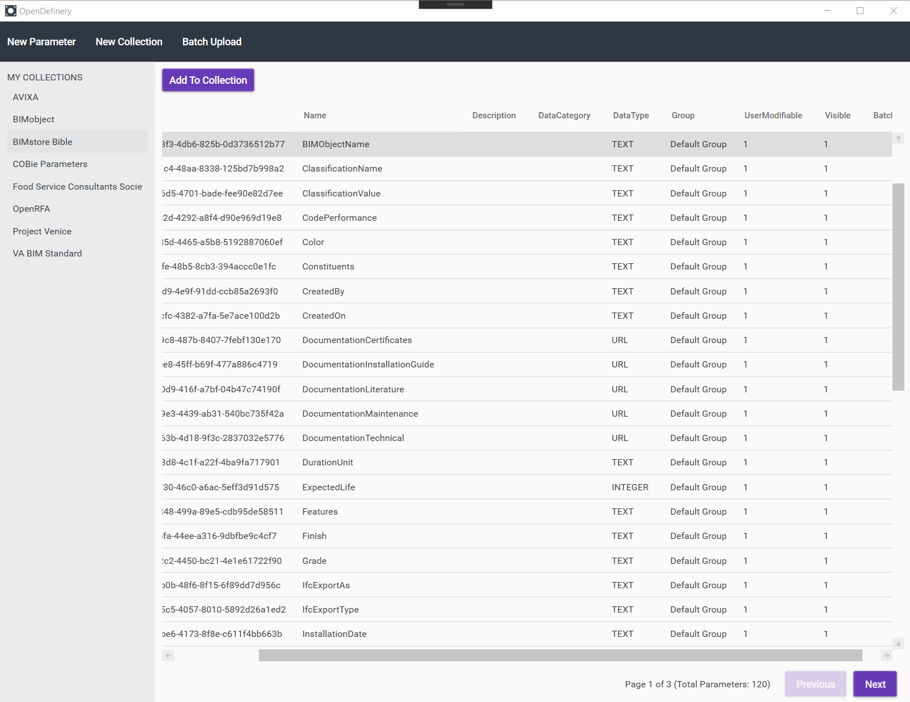

# OpenDefinery Desktop Application
The OpenDefinery desktop application seeks to replace Revit's antiquated out-of-the-box process for managing shared parameters. 

### What is OpenDefinery?
OpenDefinery is a cloud-based data warehouse of Revit Shared Parameters. This database includes the parameter definitions from Revit users throughout the industry who seek to decentralize their data standard. For more information, visit us at http://OpenDefinery.com.

Note that the platform is currently in private beta and an account is required to use this application. Reach out to i@opendefinery.com to request an account.

## Desktop App Overview

In its current state, the desktop application provides improved methods to manage and organize Revit Shared Parameters stored in the OpenDefinery repository.

### Features
- Browse Shared Parameters
- Browse Collections
- Create new Shared Parameters
- Create new Collections
- Add Shared Parameters to Collections.

### Future State of the Desktop App
- A Revit add-in to allow users to manage the Shared Parameters within their Revit projects or Revit families.

# OpenDefinery API
This application leverages the OpenDefinery REST API to manage Shared Parameters. For API documentation, refer to https://documenter.getpostman.com/view/5483074/T1LHGpQo.
